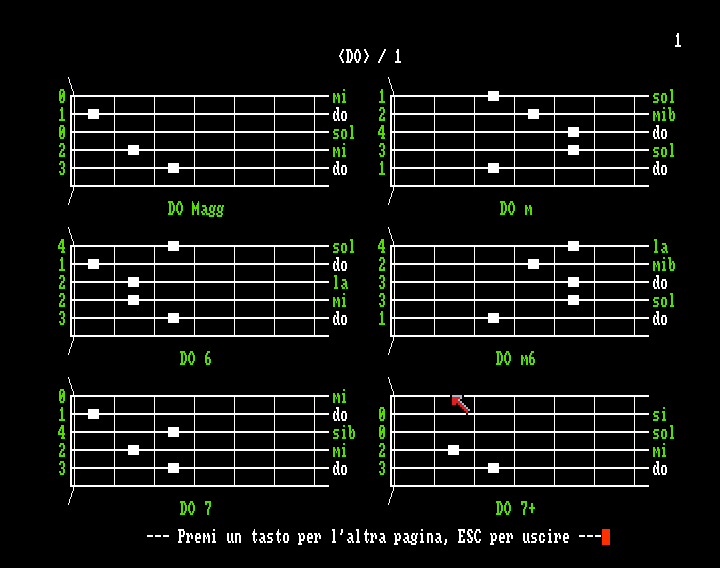
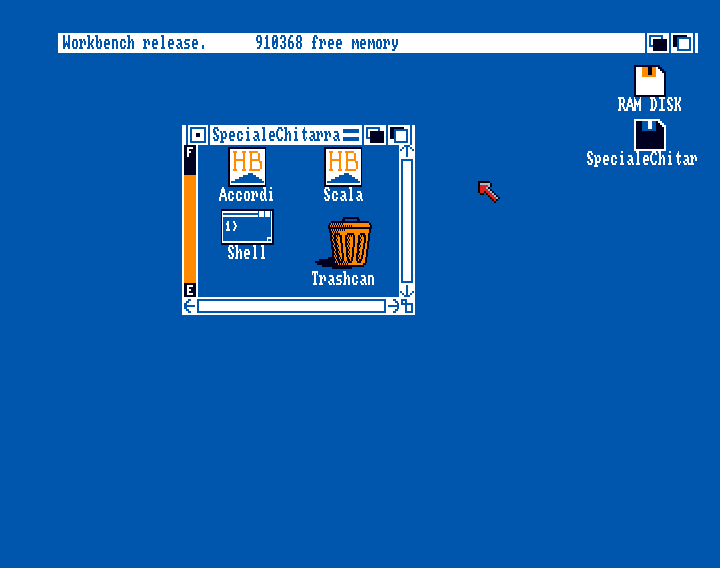

# Speciale Chitarra (1993) - per Commodore Amiga

## Struttura del repository
- **source** - Codice sorgente in HiSoft BASIC per Amiga
  - [**Accordi.bas**](https://github.com/sblendorio/chitarramiga/blob/master/source/Accordi.bas) - Sorgente in HiSoft BASIC 1.x del corso
  - [**Scala.bas**](https://github.com/sblendorio/chitarramiga/blob/master/source/Scala.bas) - Sorgente in HiSoft BASIC 1.x dell'utility di trasposizione
  - [**faccordi.txt**](https://github.com/sblendorio/chitarramiga/blob/master/source/faccordi.txt) - Definizione degli accordi sotto forma di CSV
  - [**fgiri.txt**](https://github.com/sblendorio/chitarramiga/blob/master/source/fgiri.txt) - Definizione dei giri armonici sotto forma di CSV
- **dist** - Distribuzione sotto forma di immagine di floppy disk per Amiga
  - [**SpecialeChitarra.adf**](https://github.com/sblendorio/chitarramiga/blob/master/dist/SpecialeChitarra.adf) - Disco *bootable* per Amiga comprendente sorgente e binari.

## Screenshots

